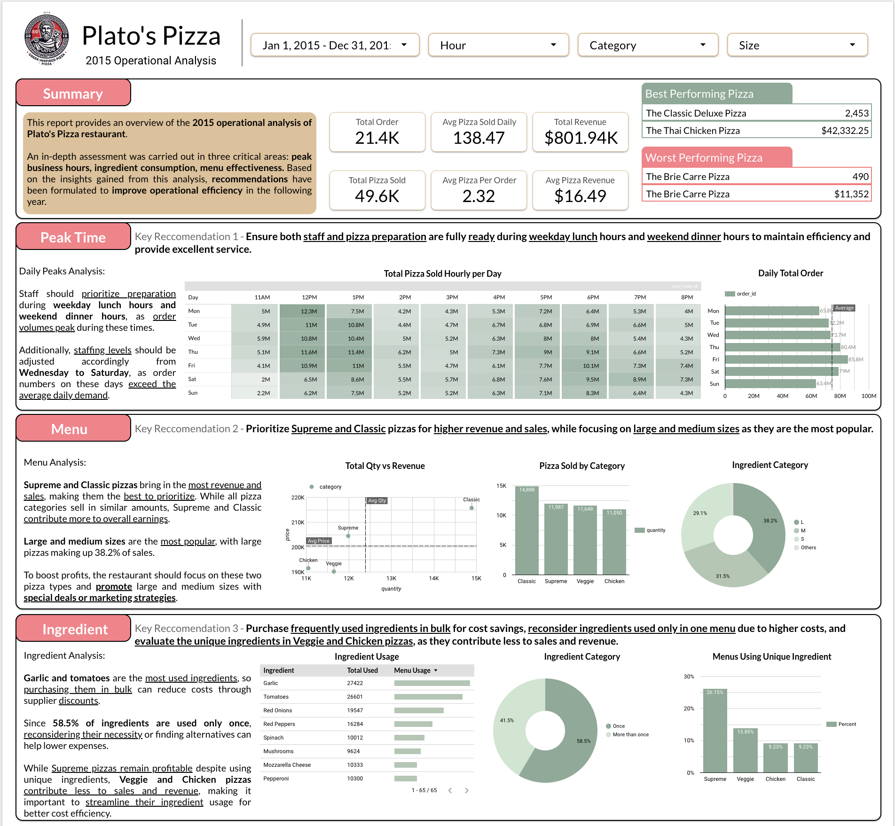

# 2015 Plato's Pizza Operational Analysis

> For more information about my projects and data journey, visit my [Portfolio](https://google.com/).

Table of Contents

- [Project Background](#project-background)
- [Executive Summary](#executive-summary)
- [Insights Deep-Dive](#insights-deep-dive)
    - [2015 Operational Summary](#2015-operational-summary)
    - [Sales Peak Analysis](#sales-peak-analysis)
    - [Menu Analysis](#menu-analysis)
    - [Ingredient Analysis](#ingredient-analysis)
- [Recommendations](#recommendations)

***

## Project Background

Plato's Pizza is a well-established Greek-inspired pizzeria located in New Jersey, recognized for its authentic flavors and high-quality ingredients. I have been hired to assist the restaurant in optimizing its operations by analyzing transactional data collected in 2015 and providing strategic recommendations for improvement.

## Executive Summary

Plato’s Pizza has achieved 21.4K total orders, selling 49.6K pizzas and generating $801.94K in revenue, with an average of 2.32 pizzas per order and $16.49 per pizza. Sales data highlights weekday lunch and weekend dinner as peak hours, requiring optimized staffing and preparation to maintain efficiency and service quality. The Classic Deluxe Pizza and Thai Chicken Pizza lead in sales and revenue, reinforcing the need to prioritize Supreme and Classic pizzas, particularly large and medium sizes, which dominate customer preference. Additionally, bulk purchasing of high-usage ingredients like garlic and tomatoes can improve cost efficiency, while reducing reliance on unique ingredients used in a single menu—especially in Veggie and Chicken pizzas, which underperform in revenue contribution. Implementing these strategies will enhance operational efficiency, maximize profitability, and streamline ingredient management.

## Insights Deep-Dive

### 2015 Operational Summary

- The restaurant processed 21.4K total orders, which translated to 49.6K pizzas sold, demonstrating a solid order volume and customer engagement.
- The average number of pizzas sold per order stands at 2.32, reflecting a strong multi-pizza purchasing trend.
- Daily sales average 138.47 pizzas, indicating a steady and predictable demand pattern.
- The Classic Deluxe Pizza leads in volume, selling 2,453 units, highlighting its strong customer preference.
- The Thai Chicken Pizza ranks highest in revenue generation at $42,332.25, signifying its premium pricing or high demand.
- The Brie Carre Pizza struggles in both sales and revenue, with only 490 units sold and $11,352 in revenue, suggesting limited customer appeal or inefficient pricing relative to cost.

### Sales Peak Analysis

- Order Volume Peaks: Sales data highlights weekday lunch hours (11 AM – 1 PM) and weekend dinner hours (6 PM – 8 PM) as key peak periods, requiring enhanced operational readiness.
- Staffing Optimization: Wednesday to Saturday consistently exceed the average daily order volume, necessitating strategic staffing adjustments to meet increased demand efficiently.
- Operational Preparedness: Staff should prioritize preparation before peak hours, ensuring seamless service flow and minimizing wait times during high-traffic periods.
- Enhanced Efficiency Measures: Streamlining pizza preparation and workflow during peak hours can improve service speed, customer satisfaction, and overall operational efficiency.

### Menu Analysis

- Revenue-Driven Prioritization: Supreme and Classic pizzas generate the highest revenue and sales, making them the primary focus for menu optimization and promotional efforts.
- Size Popularity Trends: Large (38.2%) and medium (31.5%) pizzas dominate sales, indicating a preference for bigger portions, which should guide inventory and pricing strategies.
- Category Performance: While all pizza categories sell in similar quantities, Supreme and Classic pizzas contribute significantly more to overall revenue, justifying their prioritization.
- Strategic Marketing Approach: Special promotions or targeted marketing strategies should emphasize these high-performing pizzas and popular sizes to maximize profitability.
- Menu Streamlining Opportunity: Focusing on best-selling items and preferred sizes while minimizing less popular variations can enhance operational efficiency and reduce costs.

### Ingredient Analysis

- Bulk purchasing opportunity: Garlic and tomatoes are the most frequently used ingredients, making them ideal for bulk procurement to leverage supplier discounts and reduce costs.
- Ingredient redundancy: A significant 58.5% of ingredients are used in only one menu item, suggesting an opportunity to optimize ingredient selection and reduce unnecessary expenses.
- Supreme pizzas and cost efficiency: Despite using unique ingredients, Supreme pizzas remain profitable, whereas Veggie and Chicken pizzas contribute less to overall sales and revenue.
- Menu streamlining: Since unique ingredients drive up costs, optimizing or replacing them with more versatile alternatives can improve overall cost efficiency.
- Strategic reformulation: Evaluating ingredient necessity in low-performing categories can help eliminate inefficiencies while maintaining quality and variety.

## Recommendations

Optimizing Peak Time Operations for Efficiency

- **Key Recommendation**: Ensure both staff and pizza preparation are fully ready during weekday lunch hours and weekend dinner hours to maintain efficiency and provide excellent service.
- **Optimize Staffing Allocation**: Increase staffing levels from Wednesday to Saturday as these days exceed average daily demand, ensuring smooth operations during peak order times.

*Actionable Step*: Adjust employee shifts and hire additional part-time staff for peak days to improve service speed and efficiency.
- **Enhance Preparation Efficiency**: Prioritize pizza preparation before weekday lunch hours and weekend dinner hours to minimize delays and maximize service speed.

*Actionable Step*: Implement a prep schedule that ensures ingredients are ready and pizzas can be assembled quickly during high-demand periods.

***

Maximizing Menu Performance for Higher Sales

- **Key Recommendation**: Ensure both staff and pizza preparation are fully ready during weekday lunch hours and weekend dinner hours to maintain efficiency and provide excellent service.
- **Optimize Staffing Allocation**: Increase staffing levels from Wednesday to Saturday as these days exceed average daily demand, ensuring smooth operations during peak order times.

*Actionable Step*: Adjust employee shifts and hire additional part-time staff for peak days to improve service speed and efficiency.
- **Enhance Preparation Efficiency**: Prioritize pizza preparation before weekday lunch hours and weekend dinner hours to minimize delays and maximize service speed.

*Actionable Step*: Implement a prep schedule that ensures ingredients are ready and pizzas can be assembled quickly during high-demand periods.

***

Streamlining Ingredient Management for Cost Savings

- **Key Recommendation**: Purchase frequently used ingredients in bulk for cost savings, reconsider ingredients used only in one menu due to higher costs, and evaluate the unique ingredients in Veggie and Chicken pizzas as they contribute less to sales and revenue.
- **Bulk Purchasing Strategy**: Procure high-usage ingredients such as garlic and tomatoes in bulk to leverage supplier discounts and reduce overall costs.

*Actionable Step*: Negotiate long-term contracts with suppliers to secure better pricing and maintain a steady inventory of essential ingredients.
- **Ingredient Rationalization**: Assess the necessity of unique ingredients used only in one menu, particularly in Veggie and Chicken pizzas, to streamline inventory and improve cost efficiency.

*Actionable Step*: Conduct a menu analysis to identify low-performing unique ingredients and either replace them with more versatile alternatives or eliminate them entirely.

***

- See the raw data and my cleaning, analysis, and pivot tables in the [Excel workbook](Exploration/bytex_ecommerce_analysis.xlsx).
- See my SQL queries in the [SQL file](Exploration/ecommerce_exploration.sql).
- See the notebook for data cleaning, visualization, and analysis in the [Python Notebook](Exploration/ecommerce_analysis.ipynb).
- For more of my projects and data journey, visit my [portfolio website and reach out](https://ruizdelcarmen.me/)!
